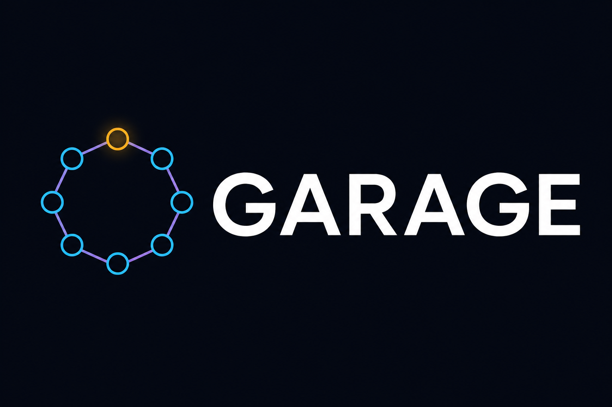
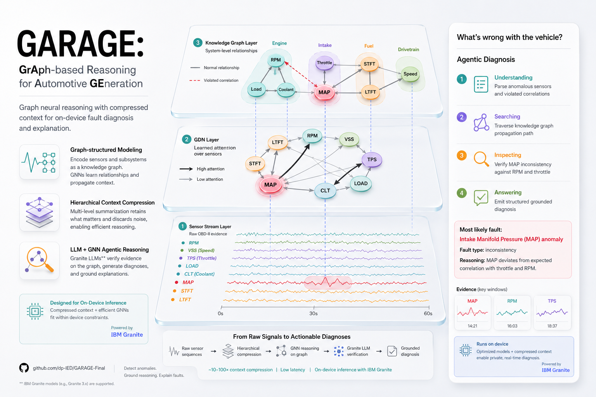
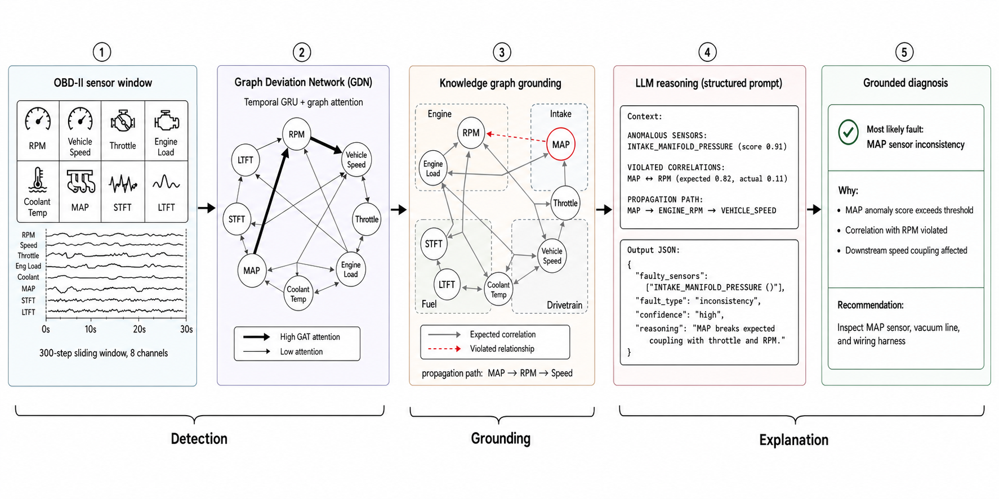
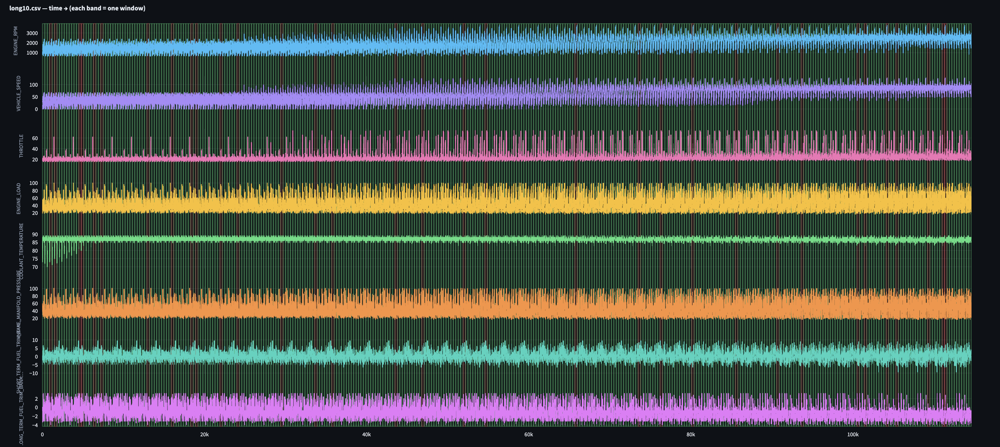
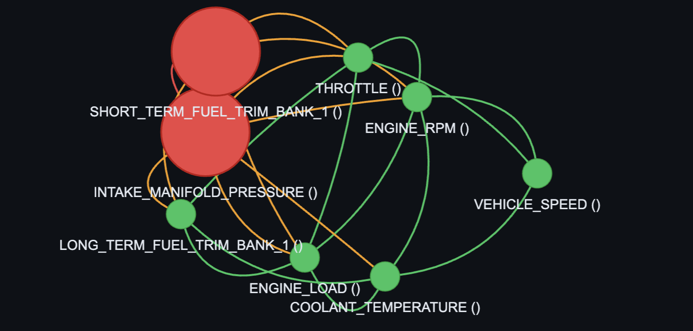

<div align="center">



# GARAGE

**GrAph-based Reasoning for Automotive diagnostics GEneration**

*Graph neural anomaly detection, knowledge-graph grounding, and LLM explanations for live OBD-II vehicle diagnostics.*

</div>

## Motivation

Automotive fault diagnosis from live OBD-II streams is difficult because anomalies are sparse, correlations across sensors are easy to miss, and raw time-series are too high-frequency for LLMs to digest as is. GARAGE chains three stages: a **Graph Deviation Network (GDN)** learns which sensor relationships matter, a **knowledge graph** encodes physical couplings and violation paths, and an **LLM** turns evidence into structured diagnoses.

<p align="center">
  
</p>

## Key Components

- **Two-Stage Graph Deviation Network**: Stage 1 self-supervised forecasting on clean drives; Stage 2 per-sensor anomaly fine-tuning with stratified fault injection (GRU + GAT).
- **Knowledge Graph Grounding**: Per-window graphs with sensor statistics, expected vs. observed correlations, violation edges, and propagation chains across Engine, Intake, Fuel, and Drivetrain subsystems.
- **Serialized KG → LLM Reasoning**: GDN scores and graph context are compressed into structured prompts; IBM Granite (via LM Studio) returns JSON with faulty sensors, fault type, confidence, and reasoning.
- **Interactive Demo & Evaluation**: Streamlit dashboard for drive browsing, graph inspection, and live diagnostics; eval scripts compare LLM baseline, GDN-only, and GDN+KG+LLM on a shared dataset.

## System Overview

<p align="center">
  
</p>

Detection (OBD window → GDN) → Grounding (knowledge graph) → Explanation (LLM → diagnosis).

## Demo

<p align="center">
  
</p>

<p align="center">
  
</p>

Browse drives, inspect sensor traces and knowledge graphs, and run live LLM diagnostics against cached GDN outputs.

## Evaluation

GDN+KG+LLM vs. LLM baseline on the shared test split (`figures/gdn_kg_llm_vs_baseline.csv`):

| Metric | LLM Baseline | GDN-KG-LLM | Improvement |
|--------|--------------|------------|-------------|
| Window F1 | 0.425 | 0.721 | +69.6% |
| Window Precision | 1.000 | 0.915 | −8.5% |
| Window Recall | 0.270 | 0.595 | +120% |
| Sensor F1 | 0.384 | 0.590 | +53.6% |
| Sensor Precision | 1.000 | 0.581 | −41.9% |
| Sensor Recall | 0.238 | 0.600 | +152% |
| Fault Type Accuracy | 0.601 | 0.693 | +15.3% |
| BERTScore F1 | 0.871 | 0.864 | −0.8% |

## Injected Fault Types

The shared dataset (`llm/evaluation/shared_dataset/`) synthetically injects faults with stratified coverage across all eight sensors. Ground-truth labels and the demo/GDN+KG+LLM pipeline use the same taxonomy (`demo/injection_catalog.py`, `demo/schemas.py`):

| Label | Target sensor(s) | Injection behaviour |
|-------|------------------|-------------------|
| `COOLANT_DROPOUT` | `COOLANT_TEMPERATURE ()` | Intermittent signal dropouts |
| `VSS_DROPOUT` | `VEHICLE_SPEED ()` | Speed signal drops to near zero |
| `MAF_SCALE_LOW` | `INTAKE_MANIFOLD_PRESSURE ()` | Manifold pressure scaled down; may co-affect `SHORT_TERM_FUEL_TRIM_BANK_1 ()` |
| `TPS_STUCK` | `THROTTLE ()` | Throttle position frozen mid-window |
| `gradual_drift` | `ENGINE_LOAD ()`, `LONG_TERM_FUEL_TRIM_BANK_1 ()` | Gradual multiplicative drift or offset |
| `normal` | — | No synthetic fault |

Additional per-sensor injections in `training/fault_injection.py` (RPM spike/dropout, STFT stuck high) are mapped to the labels above at dataset build time. Train/val splits use ~25% fault windows; test uses 30% (1,492 windows total, 447 faulty).

The **LLM baseline** evaluator (`llm/evaluation/evaluate_llm_baseline.py`) uses a separate output schema: `sensor_drift`, `signal_spike`, `flatline`, `cluster_fault`, `inconsistency`, or `normal` (`llm/evaluation/schemas.py`).

Example GDN+KG+LLM / demo output:

```json
{
  "faulty_sensors": ["INTAKE_MANIFOLD_PRESSURE ()"],
  "fault_type": "MAF_SCALE_LOW",
  "confidence": "high",
  "reasoning": "MAP anomaly score exceeds threshold; correlation with THROTTLE and ENGINE_RPM is broken."
}
```

## Project Layout

- `models/gdn_model.py` — Graph Deviation Network (GRU + GAT).
- `training/` — Stage 1 forecast pre-training, Stage 2 anomaly fine-tuning, fault injection.
- `data/create_shared_dataset.py` — Builds shared train/val/test NPZ splits from raw OBD CSVs.
- `kg/create_kg.py` — Knowledge graph construction (correlations, violations, propagation).
- `llm/gdn_processor.py` — GDN inference adapter for evaluation and demo.
- `llm/evaluation/` — Baseline and GDN+KG+LLM evaluators, metrics, result summarisation.
- `demo/` — Streamlit app, demo cache builder, live LM Studio diagnostics.
- `docker/` — Dockerfiles, `garage.sh` CLI, LM Studio headless server.
- `checkpoints/` — Pretrained Stage 1 and Stage 2 GDN weights.
- `figures/` — Logos, architecture diagrams, eval screenshots, `gdn_kg_llm_vs_baseline.csv`.

## Getting Started

Build, run the dashboard, evaluate, retrain, and compare metrics — all documented in **[README.docker.md](README.docker.md)**.

Quick start:

```bash
docker compose build
docker compose up dashboard
```

Open <http://localhost:8501>.

Evaluation outputs and metric comparison commands are also in [README.docker.md](README.docker.md).

## Requirements 

- Python `3.11+`
- PyTorch `2.5.1` and PyTorch Geometric `2.6.1`
- [LM Studio](https://lmstudio.ai/) with **IBM Granite 4.0 H Micro** (`ibm-granite/granite-4.0-h-micro-GGUF`, Q4_K_M)

Docker will set these up for you.

**Sensors (8 channels):** `ENGINE_RPM ()`, `VEHICLE_SPEED ()`, `THROTTLE ()`, `ENGINE_LOAD ()`, `COOLANT_TEMPERATURE ()`, `INTAKE_MANIFOLD_PRESSURE ()`, `SHORT_TERM_FUEL_TRIM_BANK_1 ()`, `LONG_TERM_FUEL_TRIM_BANK_1 ()`.

**Window size:** 300 timesteps.

## Notes

- Pretrained checkpoints are included; retraining is optional unless you change the dataset or fault injection settings.
- Demo cache stores GDN scores and KG context only — LLM diagnostics are always live.
- Raw OBD-II recordings live under `data/carOBD/obdiidata/`.
- Streamlit file watching is disabled (`.streamlit/config.toml`) to avoid PyTorch import watcher crashes.

## Citation

```bibtex
@misc{garage2026,
  title  = {GARAGE: GrAph-based Reasoning for Automotive diagnostics GEneration},
  author = {Palmer, Daren and others},
  year   = {2026},
  url    = {https://github.com/dp-IED/GARAGE-Final}
}
```
